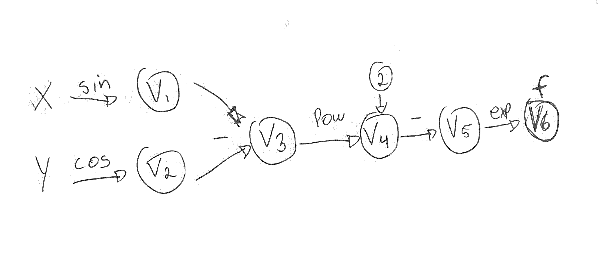

Collaborators: Matt Fernandes, Aakash Mishra, Haipeng Lin

 

| var|  func  | Current |   Deriv               | \partial x | \partial y |
|----|--------|---------| --------------------- | ---------- |----------- |
| x  | pi/2   | pi/2    | $$\dot{x}$$           | (1)        | (0)        |
| y  | pi/3   | pi/3    | $$\dot{y} $$          |  0         | (1)        |
| v1 | sin(x) | 1       | $$cos(x) \dot{x} $$   |  0         |  0         | 
| v2 | cos(y) | 1/2     | $$-sin(y) \dot{y} $$  |  0         | -sqrt(3)/2 |
| v3 | v1-v2  | 1/2     | $$\dot{v1}-\dot{v2}$$ |  0         |  sqrt(3)/2 |
| v4 | v3^2   | 1/4     | $$ 2\dot{v3}v3$$      |  0         |  sqrt(3)/2 |
| v5 | -v4    | -1/4    | $$-\dot{v4}$$         |  0         | -sqrt(3)/2 |
| f  | exp(v5)| 0.78    | $$\dot{v5}exp(v5)$$   |  0         | -0.67      |

